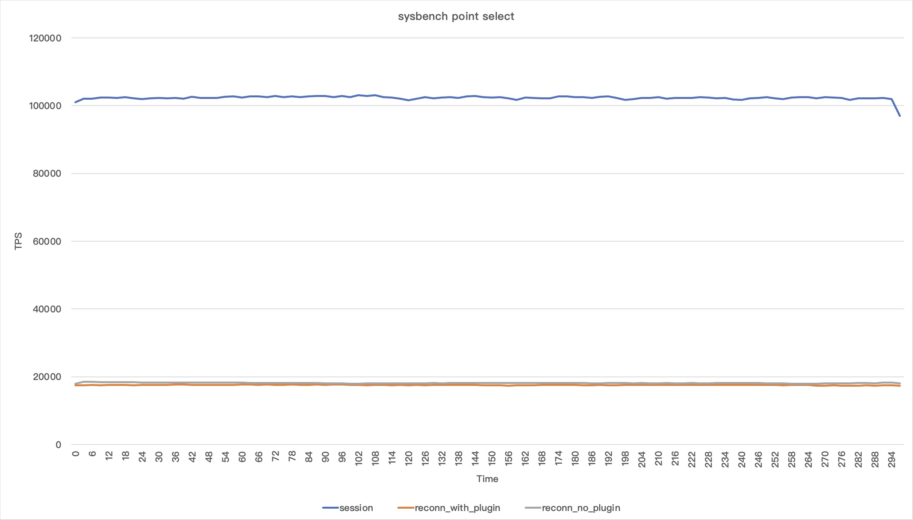

# Usage Max Disk

# Usage
```
mysql> INSTALL PLUGIN maxdiskusage SONAME 'maxdiskusage.so';
mysql> SET GLOBAL maxdiskusage_minfree=1000;
mysql> SET GLOBAL maxdiskusage_monitor_fs='/var/lib/mysql';
mysql> SET GLOBAL maxdiskusage_action='WARN';
```

With WARN:
```
mysql> INSERT INTO t1() VALUES();
Query OK, 1 row affected, 1 warning (0.00 sec)

mysql> SHOW WARNINGS;
+---------+------+------------------------------------------+
| Level   | Code | Message                                  |
+---------+------+------------------------------------------+
| Warning | 1642 | Writing to a server with high disk usage |
+---------+------+------------------------------------------+
1 row in set (0.00 sec)
```

With BLOCK:
```
mysql> INSERT INTO t1() VALUES();
ERROR 3164 (HY000): Aborted by Audit API ('MYSQL_AUDIT_TABLE_ACCESS_INSERT';1).
```

This message is also written to the error log:
```
2018-02-21T08:55:10.490978Z 12 [ERROR] Plugin maxdiskusage reported: 'BLOCKING QUERY: Free filesystem space on /home (7682 MB) is less than 10000 MB: INSERT INTO t1() VALUES()'
```

# Settings

| Setting                        | Default        | Description                                                        |
|--------------------------------|----------------|--------------------------------------------------------------------|
| `maxdiskusage_action`          | WARN           | WARN, BLOCK or WARN_AND_BLOCK                                    |
| `maxdiskusage_note`            | ''             | Note to add to the warning message                                 |
| `maxdiskusage_minfree`         | 0              | Act if less than x MB of free space is available                   |
| `maxdiskusage_monitor_fs`      | /var/lib/mysql | Directory to monitor, usally @@datadir                             |
| `maxdiskusage_pct`             | 100            | Execute the action if over this percentage of usage                |
| `maxdiskusage_block_pct`       | 100            | Block if over this percentage of usage if action is WARN_AND_BLOCK |
| `maxdiskusage_warn_skip_count` | 1000           | Skip every x events, reduces warning rate                          |

These can be set with SET GLOBAL, but you probably want to put those in your my.cnf

# Building

This is tested against MySQL 5.7 and MySQL 8.0. Pull requests for other MySQL and MariaDB
versions are welcome.

Copy the `mysql_maxdiskusage` directory to the `plugin` directory of the MySQL source code.
Build the code as usual or just run `make maxdiskusag`.
Either use the resulting build or copy `maxdiskusage.so` to the `plugin_dir`.

# Usage Audit Connection
 
1. install [spdlog](https://github.com/gabime/spdlog)
2. put `audit_connection` to `mysql_source_code/plugin`
    - e.g. /root/mysql-8.0.29/plugin/audit_connection
3. compile mysql as usual

# Install

1. after compiling, put `plugin_output_directory/audit_connection.so` in `<mysql_base_dir>/lib/plugin`
2. place the following configuration in the `[mysqld]` section of `/etc/my.cnf`

```ini
plugin-load-add=audit_connection.so
audit_connection=FORCE_PLUS_PERMANENT
```

# Log roration

1. <data_dir>/audit_connection.log;
2. 50MB per log file;
3. keep 7 files;

# Performance


